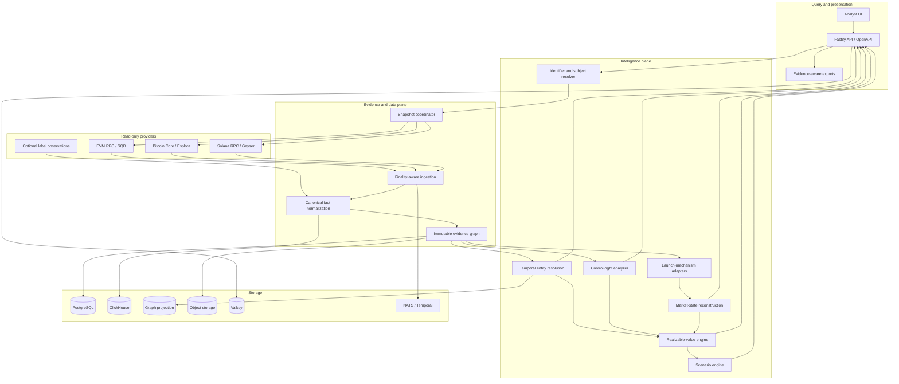
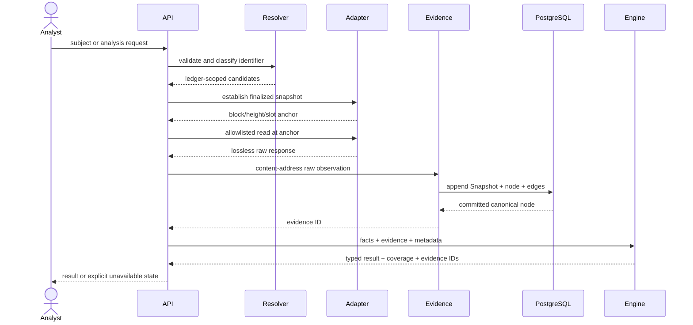
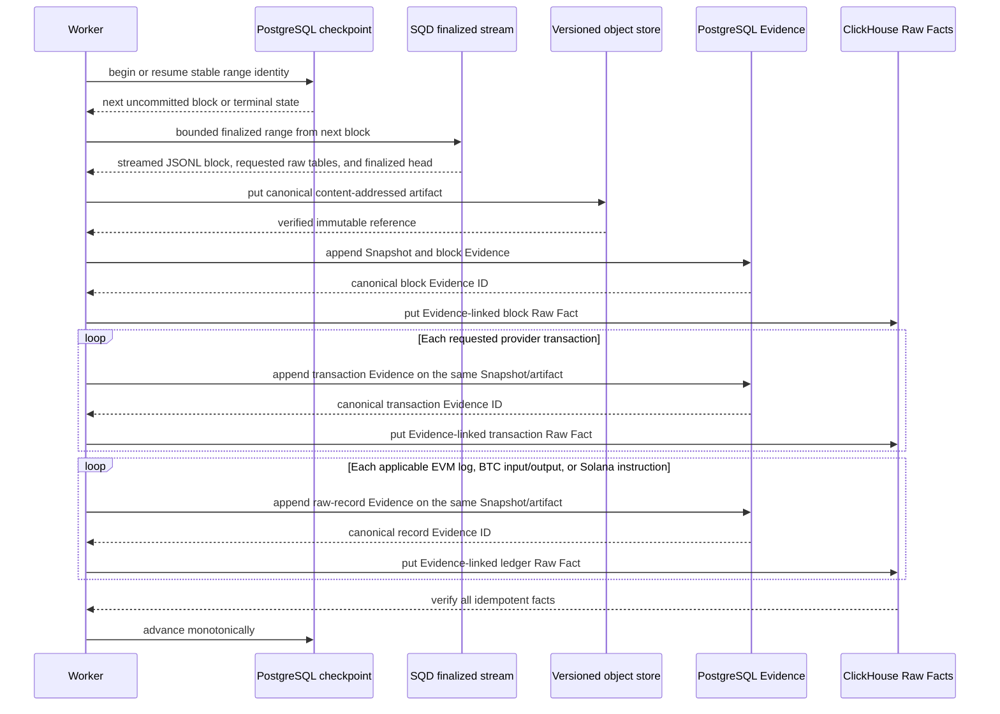

# ZeroTrace Architecture

## Status and authority

This document translates the terminal product requirements in
[ZEROTRACE_MASTER_PROMPT.md](ZEROTRACE_MASTER_PROMPT.md) into implementation boundaries. The Master
Prompt remains authoritative when the two differ. [PROGRESS.md](../../PROGRESS.md) is authoritative
for what is implemented today.

ZeroTrace is a read-only intelligence system. It may construct or simulate transaction semantics for
analysis, but it must never store private keys, sign transactions, execute swaps, or broadcast
transactions.

## Non-negotiable invariants

1. Every material conclusion references immutable evidence and a ledger snapshot.
2. Missing knowledge is a typed state. Unknown, unavailable, unsupported, stale, and not applicable
   are not numeric zero.
3. Entity claims are probabilistic and split into controller, coordination, and independence
   probabilities.
4. Shared infrastructure, exchanges, relayers, routers, mixers, and CoinJoin are suppression signals,
   not naive entity-merge signals.
5. Book value, mark-to-market value, quote value, and realizable value remain separate.
6. Realizable value declares route, capacity, taxes, fees, gas, failure conditions, snapshot, and
   evidence.
7. Protocol semantics are versioned by deployment and time. Current ABIs or IDLs cannot silently
   reinterpret historical events.
8. Provider health and coverage are part of every result. A provider outage cannot become a
   confident empty result.
9. Raw facts are append-only; derived state is reproducible from evidence, model version, and
   parameters.
10. The public runtime exposes no write-capable chain method.

## Logical architecture

Solid paths describe the terminal design. The current runtime wires query-time provider reads,
canonical facts, a process-local Evidence cache backed by durable PostgreSQL Snapshots/nodes/edges,
and a separate finalized raw-ledger worker backed by versioned artifacts, ClickHouse Raw Facts, and
PostgreSQL checkpoints. Blocks, transactions, EVM logs, Bitcoin inputs/outputs, and Solana
instructions are wired. Baseline entity inference, two deterministic RV algorithms, API, and UI are
also wired. Provider-shaped records are not transaction-level semantic normalization; graph
projection and workflow behavior must not be inferred as complete. Consult the
progress ledger.

## Canonical concepts

### Ledger snapshot

Each analysis is anchored independently:

- EVM: chain ID, block number, block hash, captured time;
- Bitcoin: network, height, best-block hash, captured time;
- Solana: cluster, slot, blockhash when available, commitment, captured time.

Cross-chain results are a snapshot set, not a fictional global block. The set records capture skew
and the finality policy used for each ledger.

### Subject

A Subject is a ledger-scoped object such as an address, transaction, token, UTXO, program, contract,
pool, launch, or inferred entity. Native identifiers retain chain scope. An EVM address without chain
context is ambiguous and must not silently default in persisted intelligence.

### Knowledge value

Every uncertain field uses a discriminated state:

- `known`: a value is supported at the declared snapshot;
- `unknown`: the system cannot determine it from current evidence;
- `unavailable`: a required provider or capability failed or was not configured.

Reason codes and optional details are carried alongside non-known states. APIs and UI preserve those
states end-to-end.

### Evidence

Evidence IDs hash canonical observation content plus the sorted derivation-edge set. A node records
ledger, chain, source, locator, snapshot position, finality, payload hash, capture time, and summary.
Derived and negative evidence must list source Evidence IDs. The in-memory ledger is an immutable
runtime cache; the PostgreSQL repository transactionally persists complete Snapshots, Evidence nodes,
and edges and supports drilldown after restart. Implemented ingestion observations bind a
content-addressed, read-after-write-verified raw artifact; query-time provider observations do not yet
persist their raw response bodies.

### Entity relationship

The engine returns independent controller, coordination, and independence probabilities. Feature
weights incorporate reliability and evidence IDs. Service hubs and privacy/co-spend patterns suppress
overconfident merging. The baseline is deterministic and testable but is not yet a calibrated
production entity model.

### Realizable value

The implemented kernel uses exact integer arithmetic for a constant-product pool and represents a
disabled or impossible sell as unavailable. The seeded exit-race simulation mutates shared reserves
in order and reports deterministic distributions. Multi-route liquidity, transfer taxes, protocol
fees, gas, slippage limits, reverts, bridges, CEX assumptions, and historical execution calibration
remain terminal requirements.

## Read query sequence

No request path falls back to a send method. If a provider lacks the necessary historical or
snapshot-consistent read, the operation returns unavailable.

## Finalized ingestion commit sequence

Checkpoint advancement is last. A crash before it causes replay of content-addressed/idempotent
writes; a terminal checkpoint prevents any provider or storage call on rerun. Source-head reach is a
distinct terminal state and never becomes an invented empty range.

## Provider boundary and transport security

The shared provider transport is defensive because provider URLs are privileged server-side
connections:

- HTTPS by default, with explicit opt-in for private local infrastructure;
- hostname allowlist and DNS/IP checks against loopback, private, link-local, multicast, and reserved
  space;
- no embedded URL credentials, fragments, path traversal, or redirects;
- bounded response size, request timeout, per-endpoint pacing, and JSON content validation;
- bounded exponential retry with capped `Retry-After`, in-flight deduplication, TTL/LRU response
  caching, per-endpoint circuit breakers, and ordered sticky failover;
- hostname-based source identifiers and transport diagnostics that exclude credentials and URL
  paths;
- lossless handling of integers beyond JavaScript's safe range;
- adapter-level method allowlists.

EVM rejects `eth_sendRawTransaction` and related write methods. Solana rejects
`sendTransaction`. Bitcoin uses only Esplora GET resources in the current adapter. These are
security boundaries and have regression tests.

## Storage ownership

| Store            | Intended authority                                                                                     | Current state                                                                                                            |
| ---------------- | ------------------------------------------------------------------------------------------------------ | ------------------------------------------------------------------------------------------------------------------------ |
| PostgreSQL       | subjects, snapshots, evidence metadata/edges, entities, rights, launches, scenarios, analyst overrides | Evidence/Snapshot and ingestion checkpoints wired; other repositories pending                                            |
| ClickHouse       | raw normalized facts, platform events, time-series metrics                                             | finalized EVM execution/state, Bitcoin UTXO, and Solana execution/balance Raw Facts wired; semantic facts/series pending |
| Object storage   | raw provider payloads and large artifacts by content hash                                              | versioned content-addressed artifacts wired for finalized ingestion                                                      |
| Graph projection | temporal entity/control traversal                                                                      | Optional Apache AGE service only                                                                                         |
| Valkey           | bounded cache, locks, rate coordination                                                                | Compose service only                                                                                                     |
| NATS / Temporal  | ingestion events and durable workflows                                                                 | Compose/profile services only                                                                                            |

PostgreSQL Evidence, derivation-edge, Snapshot, and ingestion-run tables include append-only or
monotonic guards. Deferred database constraints reject inferred Evidence without a source edge,
while repositories verify canonical IDs, Snapshot identity, idempotent conflicts, and transactional
writes. ClickHouse Raw Facts bind Evidence and artifact references and use explicit logical
deduplication; metric tables enforce a knowledge-state/value consistency constraint.

The worker exposes explicit `block-headers`, `transactions`, and `ledger-records` profiles. The last
profile materializes transactions plus EVM logs/traces/state diffs, Bitcoin inputs/outputs, or Solana
instructions/logs/native balances/token balances/rewards as applicable. Each table uses a
discriminated `MATERIALIZED`, `NOT_QUERIED`, or `NOT_APPLICABLE` state; only materialized tables
receive a numeric count. SQD may omit an explicitly requested optional table when it has no rows,
which is a known zero only for that requested table. Bitcoin coinbase outpoints and one-sided Solana
token-balance fields remain explicitly null. EVM trace identity uses block hash, provider transaction
index, and complete trace address; state-diff identity adds the changed account/state key. Solana
instruction identity uses blockhash, provider transaction index, and the complete
instruction-address path; the transaction index is not assumed to be a returned-array offset.
Solana skipped-slot ranges are advanced only when the finalized-head header proves coverage; an empty
stream with Unknown head remains an error.

## Platform-adapter policy

Protocol-specific adapters live behind the canonical launch/market interfaces:

- use official deployment discovery, ABI/IDL, program account state, and version windows;
- preserve unknown mechanisms when discovery is incomplete;
- keep copyleft or unclear-license components behind a process/API boundary until reviewed;
- never copy proprietary schemas or code into the Apache-2.0 core;
- validate each decoder against named real transactions/accounts and retain the evidence fixture.

The evaluated repositories, revisions, licenses, and intended boundaries are recorded in
[THIRD_PARTY_DEPENDENCIES.md](../research/THIRD_PARTY_DEPENDENCIES.md).

## Deployment topology

The default local topology is a single API and static web container plus PostgreSQL, ClickHouse,
Valkey, NATS, and MinIO. The bounded finalized-range worker, Temporal, and a graph database are
profiles so the foundation remains startable while preserving terminal seams. Production
deployments must add TLS termination, secret management, provider-specific quotas, persistent
backups, network policy, observability, scheduling/horizontal worker scaling, and disaster recovery.

## Definition of production acceptance

An architecture slice is accepted only when:

1. its source and license are recorded;
2. raw and derived evidence can be drilled down;
3. snapshot/finality, coverage, freshness, and model version are visible;
4. Unknown is exercised in tests and UI;
5. unit, integration, and real-browser tests pass;
6. named real-chain fixtures have been verified against at least one independent source where
   practical;
7. provider failure, reorg/finality, rate limiting, precision, and adversarial inputs have been
   tested;
8. the progress ledger marks the capability complete with evidence.

A green process health check alone is not production acceptance.
