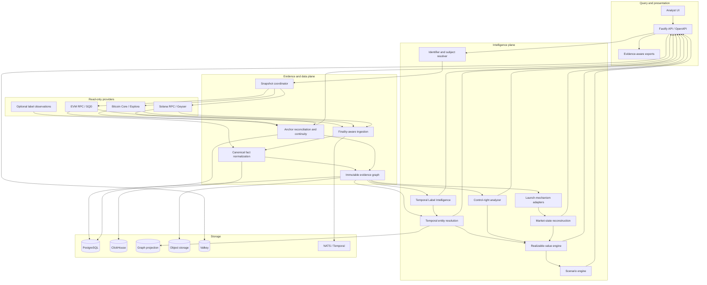
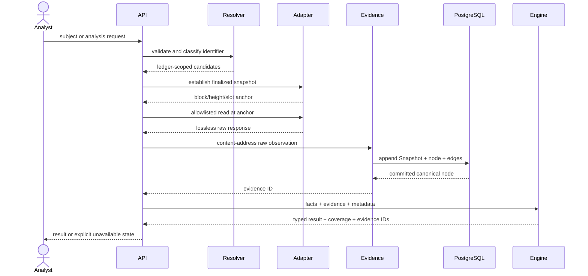

# ZeroTrace Architecture

> 冲突优先级（2026-08-19）：监管取证升级入口 > 提示词包 > `AGENTS.md` > 本目录 ADR > 本文档 > 旧 Master Prompt。新要求不得削弱 Evidence、Snapshot、Unknown≠0、只读链上边界、来源独立性、可回放和许可证隔离。

产品定位：链上监管取证级盘面结构分析。UI 为中文取证工作站；LLM 只做声明解析、证据解释、协议研究、结构化报告和只读查询编排。

## Status and authority

This document translates the terminal product requirements in
[ZEROTRACE_MASTER_PROMPT.md](ZEROTRACE_MASTER_PROMPT.md) into implementation boundaries. The Master
Prompt remains authoritative when the two differ. [PROGRESS.md](../../PROGRESS.md) is authoritative
for what is implemented today.

ZeroTrace is a read-only intelligence system. It may construct or simulate transaction semantics for
analysis, but it must never store private keys, sign transactions, execute swaps, or broadcast
transactions.

## Non-negotiable invariants

1. Every material conclusion references immutable evidence and a ledger snapshot.
2. Missing knowledge is a typed state. Unknown, unavailable, unsupported, stale, and not applicable
   are not numeric zero.
3. Entity claims are probabilistic and split into controller, coordination, and independence
   probabilities.
4. Shared infrastructure, exchanges, relayers, routers, mixers, and CoinJoin are suppression signals,
   not naive entity-merge signals.
5. Book value, mark-to-market value, quote value, and realizable value remain separate.
6. Realizable value declares route, capacity, taxes, fees, gas, failure conditions, snapshot, and
   evidence.
7. Protocol semantics are versioned by deployment and time. Current ABIs or IDLs cannot silently
   reinterpret historical events.
8. Provider health and coverage are part of every result. A provider outage cannot become a
   confident empty result.
9. Raw facts are append-only; derived state is reproducible from evidence, model version, and
   parameters.
10. The public runtime exposes no write-capable chain method.
11. Named assets and platform acceptance cases validate generic domains; they never introduce
    token-specific branches, defaults, thresholds, addresses, or inference rules into shared
    ingestion, Evidence, Entity Resolution, Control Rights, Claim, Scenario, or RV engines.

## Logical architecture

Solid paths describe the terminal design. The current runtime wires query-time provider reads,
canonical facts, a process-local Evidence cache backed by durable PostgreSQL Snapshots/nodes/edges,
and a separate finalized raw-ledger worker backed by versioned artifacts, ClickHouse Raw Facts, and
PostgreSQL checkpoints. Strict query-time EVM/Bitcoin/Solana block and transaction records plus
Bitcoin outpoints are Snapshot- and Evidence-bound; finalized blocks, transactions, EVM logs,
Bitcoin inputs/outputs, and Solana instructions are also wired through ingestion. A separate
Bitcoin transaction-entity layer now derives fee/address coverage, common-input and bounded change
candidates plus equal-output/fanout suppression from the validated transaction record. BIP78 is a
versioned Evidence parent, and every automatic ownership merge remains disabled because Payjoin,
service/custody and complete-history contamination are not excluded. A separate
semantic worker persists restart-safe Flap origin checkpoints and immutable bounded-history
segments; the API and UI replay those stored segments by scan ID without provider access. Baseline
entity inference, two deterministic RV algorithms, API, and UI are wired. Query-time endpoint anchors are
compared at a common position, parent continuity is checked against prior observations, and
Evidence-linked alerts are stored when sources conflict or history changes. Provider-shaped records
and validated EVM receipts are not transaction-level semantic normalization;
operator independence, graph projection, rollback/replay, and workflow behavior must not be
inferred as complete. Consult the progress ledger.

## Canonical concepts

### Ledger snapshot

Each analysis is anchored independently:

- EVM: chain ID, block number, block hash, parent hash, explicit
  `latest`/`safe`/`finalized` selection, captured time;
- Bitcoin: network, height, height-resolved best-chain hash, previous block hash, captured time;
- Solana: cluster, slot, that slot's `getBlock` blockhash, parent slot, previous blockhash,
  commitment, captured time.

Cross-chain results are a snapshot set, not a fictional global block. The set records capture skew
and the finality policy used for each ledger.

### Subject

A Subject is a ledger-scoped object such as an address, transaction, token, UTXO, program, contract,
pool, launch, or inferred entity. Native identifiers retain chain scope. An EVM address without chain
context is ambiguous and must not silently default in persisted intelligence.

### Knowledge value

Every uncertain field uses a discriminated state:

- `known`: a value is supported at the declared snapshot;
- `unknown`: the system cannot determine it from current evidence;
- `unavailable`: a required provider or capability failed or was not configured.

Reason codes and optional details are carried alongside non-known states. APIs and UI preserve those
states end-to-end.

### Evidence

Evidence IDs hash canonical observation content plus the sorted derivation-edge set. A node records
ledger, chain, source, locator, snapshot position, finality, payload hash, capture time, and summary.
Derived and negative evidence must list source Evidence IDs. The in-memory ledger is an immutable
runtime cache; the PostgreSQL repository transactionally persists complete Snapshots, Evidence nodes,
and edges and supports drilldown after restart. Implemented ingestion observations bind a
content-addressed, read-after-write-verified raw artifact; query-time provider observations do not yet
persist their raw response bodies.

### Label observation and Label Snapshot

A label is a source observation about one exact ledger-scoped Subject, not a fact that two Subjects
share an owner. Each observation retains its source class, source confidence, actor candidate,
validity Knowledge, observed time, license policy, raw-payload hash and Evidence IDs. Deterministic,
curated, commercial, community and inferred observations coexist; source priority only determines
review order and never silently discards a conflict.

`label-intelligence-v0.1.0` materializes every registered observation for one Subject and one
analyst-supplied `asOf` policy into a content-addressed `lss_...` Label Snapshot. Future, active,
stale and expired observations remain distinct. Conflicting label values, actor candidates and
determinism claims are persisted with `PRESERVED` disposition. Service/CEX/bridge/mixer/custody
observations conservatively suppress downstream ownership propagation; absence of such an
observation does not prove that the Subject is not a Service Hub.

Migration `023_label_intelligence_reports` stores immutable `lir_...` reports and database guards
bind the Subject, exact observation payloads, source Evidence, terminal derivation, model and the
following hard rules: labels cannot merge Entities, risk labels cannot establish common control,
and matching text across chains cannot merge Subjects. The requested observation-set coverage is
Known only for the exact registered set. Global-source and history coverage remain Unknown until
source adapters and temporal capture schedules prove them.

### Anchor reconciliation and continuity

The query-time data-quality service treats each configured endpoint as an observation source, not
as proof of an independent operator:

1. read every endpoint head with stored response caching bypassed;
2. persist each successful `HEAD` anchor and raw block Evidence;
3. choose the minimum successful block/slot as the common comparison position;
4. re-read faster endpoints at that exact historical position and persist `COMPARISON` anchors;
5. compare ledger, chain, position, hash, parent identity, and finality as one identity;
6. return `AGREEMENT` only when at least the configured minimum (two by default) all match;
7. return `DISAGREEMENT` with no canonical winner and a CRITICAL Evidence-linked alert when any
   identity differs; fewer observations remain `INSUFFICIENT_SOURCES` or `UNAVAILABLE`.

The service never uses majority voting to turn a conflict into canonical truth. `sourceIndependence`
remains `Unknown(NOT_QUERIED)` until ownership and infrastructure independence are explicitly
configured and verified.

For continuity, the service compares each new head with that source's latest stored head. It records
unchanged and direct-parent extensions as Known continuous. When observations skip positions, it
re-reads the former position: the same historical hash is `HISTORICAL_MATCH`; a replacement is
`REORG_DETECTED`; a lower reported head is `SOURCE_REGRESSION`; and a failed check is explicitly
unavailable. Reorg/regression alerts link the prior, current, optional historical-check, and derived
Evidence. Flap lifetime heads additionally verify every successful participant at stored accepted
positions, invalidate the exact divergent suffix and replay from the newest evidenced common
ancestor. This automatic rollback is currently Flap-specific; general multi-chain semantic rollback
remains open.

### Entity relationship

The engine returns independent controller, coordination, and independence probabilities. Feature
weights incorporate reliability and evidence IDs. Service hubs and privacy/co-spend patterns suppress
overconfident merging.

Every featureful API result is materialized as an immutable, content-addressed pairwise hypothesis
report. The API canonicalizes the subject pair, features, direct Evidence IDs and actual Evidence
source set; rejects duplicate kind/Evidence inputs and ungrounded service flags; fixes the engine
version to `entity-v0.1.0`; and fails closed unless durable Evidence and report repositories are
available. Migration `018_entity_relationship_reports` binds the report to one non-null Snapshot,
the exact durable Evidence payloads and terminal derivation parents, and database-enforces
`automaticOwnershipMergeAllowed=false`. Latest and exact `erh_...` routes are PostgreSQL-only and
remain usable without chain providers. A featureless pair remains explicit `UNKNOWN` and is not
persisted as if it were an observed conclusion. These reports are hypotheses, not entity-membership
mutations or label-driven merges.

The separate versioned evaluation system uses millionth-scale fixed-point probabilities and exact
integer comparisons. It gates high-confidence controller precision at `>= 0.98`, coordination
precision at `>= 0.95`, Service Hub false merges at `<= 0.001`, and CoinJoin false merges at exactly
zero. Brier score and expected calibration error are calculated per independent probability axis.
A `LABELED_REAL_WORLD` corpus requires every prediction to retain a ledger Snapshot, canonical
`ev_<24 hex>` Evidence IDs and non-test label sources, plus at least 100 labeled cases per axis,
Brier `<= 0.15`, and ECE `<= 0.05`; missing denominators produce `INSUFFICIENT_DATA`. The checked-in
`STRUCTURAL_GOLDEN` corpus is test-only and can prove regression and suppression behavior, but its
calibration values are `DIAGNOSTIC_ONLY` and cannot establish a calibrated production entity model.
Durable pairwise timelines, a bounded exact-Snapshot investigation projection, and immutable
cross-Snapshot graph-report timelines are implemented. Continuous extraction/rebuild, temporal
traversal and a real labeled corpus remain open.

#### Investigation graph projection

The `entity-investigation-graph-v0.1.0` materializer accepts only immutable relationship timelines
whose terminal observations share one exact ledger Snapshot. It creates investigation relations,
not a copy of all transfers: positive controller classifications become `SAME_CONTROLLER`, while
`COORDINATED_BUT_INDEPENDENT` becomes the separate `COORDINATED_WITH` relation. Likely-independent,
service-suppressed, infrastructure and Unknown states stay as observations without edges. Service
infrastructure can never acquire a propagated ownership edge.

The content-addressed PostgreSQL report is authoritative and includes every requested timeline,
node, projection decision, edge, navigation component, source, coverage field, model version and
terminal Evidence lineage. Components are only a bounded navigation aid and explicitly cannot
become Entity membership. Latest/exact replay and traversal do not contact chain providers;
traversal is capped at depth three and 200 nodes.

Apache AGE is an optional derived accelerator. Projection runs transactionally into a dedicated
graph with only `Subject`, `SAME_CONTROLLER` and `COORDINATED_WITH` records plus report/Evidence
identity. Its immutable registry and replay count checks detect drift. AGE unavailability is
reported independently and never changes, replaces or deletes the PostgreSQL report. The analyst
UI uses Cytoscape.js to render only the bounded returned subgraph and opens each edge's Evidence
derivation ledger. There is no automatic ownership propagation, Entity merge or chain-write path.

#### Investigation graph timeline

`entity-investigation-graph-timeline-v0.1.0` compares two to 100 immutable `eig_...` reports from
one ledger and chain. Reports are ordered by chain position, capture time and graph ID. Same-position
captures are revisions; position advances carry an exact continuity Knowledge value when parent
identity proves it, remain Unknown across gaps or missing parent identity, and become Known false
on a hash conflict.

Each transition records typed pair-state changes and subject additions/omissions within the two
requested graph scopes. A missing pair is `Unknown(NOT_QUERIED)`: it never establishes a
relationship end, an entity exit, a graph split/merge, or any membership mutation. The timeline
copies no raw transfers and every observation is bound to the exact immutable graph terminal
Evidence. PostgreSQL migration `021_entity_investigation_graph_timelines` validates the source
graphs, transitions, Evidence parents, result identity and no-mutation invariants and forbids update
or delete. Materialize/latest/exact API paths and the responsive UI are provider-free. A generic
durable scheduler foundation exists, but continuous graph capture handlers, protocol-scale rebuilds,
authenticated analyst overrides and calibrated ownership decisions remain separate work.

For Bitcoin, a transaction-level model may emit common-input and script-type change candidates only
as derived features. Equal-output CoinJoin-like structure, fanout/batching, incomplete prevout
address coverage, unresolved Payjoin provenance, and unqueried service attribution are explicit
suppression reasons. CoinJoin/fanout/incomplete patterns suppress change candidates before scoring,
and the API contract fixes `automaticOwnershipMergeAllowed=false`. This bounded screen is not a
complete CoinJoin classifier, address cluster, change history, peeling-chain analysis, external
attribution, or calibrated Entity Resolution result.

### Control Campaign and forensic Evidence line

`control-campaign-v1` is a derived, read-only investigation layer over canonical chain Evidence and
ledger Snapshots. It preserves the domain boundaries required by the Master Prompt as separate
content-addressed records:

1. `token-flow-v1` stores lossless atomic flow edges with execution/finality, quote context,
   Evidence ID, raw artifact reference and exact block identity. Failed observations are retained
   but never enter materialized balances; internal transfers are explainable gross movement and do
   not change net cluster position.
2. `candidate-discovery-v1` produces token-scoped wallet candidates with reasons, coverage and
   service exclusions. It never mutates Entity membership.
3. `cluster-position-v1` applies the conservation identity
   `initial + externalIn - externalOut + mint - burn = actual` using raw integer strings and
   fails closed on a mismatch. Supply ratio, sell-ready quantity and realizable quote value remain
   typed Unknown when the required observation is absent.
4. `behavior-event-v1` records Evidence-backed feature observations, family caps, coverage shrink,
   an uncalibrated score and hard suppression reasons. Service Hub, CEX, bridge, router/common
   infrastructure and dust boundaries stop attribution; suppression is not represented as a
   numeric zero confidence.
5. `control-campaign-v1` segments cluster/funding/settlement observations into deterministic
   Campaign IDs while keeping control, coordination and campaign confidence independent. Campaign
   scores become confidence values only after an explicit calibrated status.
6. `forensic-evidence-line-v1` groups direct/derived/attribution Evidence by phase and terminal
   boundary. Derived Evidence must reference source Evidence and the same Snapshot. It is a
   navigation ledger, not a second raw-fact authority and not a conclusion about a person.

Migration `031_control_campaign_reports` stores immutable, result-hash-verified bundles for
provider-free latest/exact/Event/Evidence replay. ClickHouse migration `002_control_campaign_flow`
defines append-only-ready raw flow, trade, feature and position projections while PostgreSQL
remains authoritative for the forensic bundle. The API and UI expose Campaign Timeline, positions,
wallet candidates, layer-filtered graph navigation and the Evidence Line. Token history discovery,
historical backfill, live monitoring, alerts, export and calibration remain explicit external gates;
their contract routes return `501 NOT_IMPLEMENTED` until real provider/workflow adapters are
accepted. No signing, broadcasting, automatic fund movement, Entity merge or membership mutation
is permitted.

Phase 1 adds the first provider-backed Token History Discovery path without changing those
boundaries. A finalized SQD ERC-20 Transfer range is captured through the existing artifact,
Evidence, Raw Fact, and checkpoint commit order; bounded contract-creation traces provide a typed
origin result when deployment is inside the requested range; and an optional exact read-only EVM
RPC binds transaction/receipt placement plus Action Semantics at the same finalized Snapshot.
Missing exact RPC is `Unknown`, provider failure is `Unavailable`, and immutable PostgreSQL report
replay retains coverage, freshness, source set, model/policy versions, checkpoint, and result hash.
Archive-scale backfill, independent provider reconciliation, continuous monitoring, alert/export
delivery, calibration, and fresh durable multi-store acceptance remain open gates.

The next bounded layer is `funding-settlement-v1.0.0`. It consumes exact finalized EVM transaction
and receipt observations rather than replacing the Token Flow authority. Native value and canonical
ERC-20 Transfer logs become `evm-asset-transfer-observation-v1` records only after placement and
identity agreement. Deterministic direct and finite-hop funding/settlement edges retain the
underlying transaction, Evidence, raw artifact references, exact block, coverage scope, freshness,
source set, model/policy versions, and uncalibrated confidence. Failed or unknown execution stays
provisional; it is never coerced into a zero-valued or successful edge. `SERVICE_HUB`, CEX, DEX
router, and bridge boundaries emit explicit suppression records and stop propagation.

PostgreSQL migration `033_funding_settlement_reports` stores immutable report envelopes and the API
offers provider-free latest/exact replay. The Control Campaign UI displays edge counts, paths,
coverage scope, Snapshot, drilldown and suppressed boundaries, while explicitly stating that the
graph is transaction evidence and not ownership proof. BSC and Ethereum public bounded smokes are
recorded as `PARTIAL`/`TRANSACTION_LOCAL`; durable multi-store capture, range-complete history,
historical code classification, service registry attribution, calibration and monitoring remain
open production gates.

### Global intelligence search

`global-intelligence-search-v0.1.0` is a provider-free read projection over authoritative durable
records, not a second fact store. PostgreSQL migration `022_durable_intelligence_search` exposes
identifier-bearing roles from the current immutable Claim, Control, Solana transaction, pension and
Entity report families together with registered label observations. Search results retain each
source record identity, Snapshot knowledge, source set, model version, confidence knowledge,
freshness and complete terminal Evidence.

Subject Registry enrichment is deliberately non-merging. A matching registered subject may expose
its label observations and Entity-membership candidates, but a label never creates or merges an
Entity. No registry binding is `Unknown(NOT_QUERIED)`; a registered subject with no matching rows is
a Known empty set. Entity confidence and membership probability preserve their stored Known,
Unknown, or Unavailable state.

The query planner runs local checksum/structure classification independently from the PostgreSQL
projection. Storage absence or failure degrades only the durable partition. A Known empty projection
means no exact match inside `IMMUTABLE_REPORTS_AND_REGISTERED_LABELS_V1`, never that a subject is
absent from a chain. Verified symbol/ticker lookup, platform/project names, complete Subject Registry
coverage and semantic-checkpoint indexing remain explicit terminal gaps.

### Realizable value

The implemented kernel uses exact integer arithmetic for a constant-product pool and represents a
disabled or impossible sell as unavailable. The seeded exit-race simulation mutates shared reserves
in order and reports deterministic distributions. Multi-route liquidity, transfer taxes, protocol
fees, gas, slippage limits, reverts, bridges, CEX assumptions, and historical execution calibration
remain terminal requirements.

The first migrated-market composition binds Flap inspection and PancakeSwap V2 reads to one
finalized BSC Snapshot. A versioned official deployment registry supplies the expected factory,
router, fee, and documentation provenance; the adapter then verifies bytecode, `pair.factory()`,
`token0`, `token1`, `getPair`, router factory, decimals, and positive reserves on chain. Each requested
buy size records the official router `getAmountsOut` result and an independently implemented
constant-product result using exact integers and the documented 25 bps fee. Their atomic output is
automatically checked against a versioned 10 bps deterministic budget. A configured Flap buy-tax
estimate is kept separate from both gross output and actual execution-net output. Until a pinned-fork
swap observes token tax, swapback, gas, and failure behavior, actual execution remains Unknown. A
transfer into movable pension-wallet custody is neither an irreversible burn nor a second pool
impact; this boundary is returned explicitly rather than encoded as a price adjustment. One RPC
operator plus official documentation yields source coverage `0.5`, not independent-source
acceptance.

The pension-entry composition crosses Claim Verification and Realizable Value without collapsing
their meanings. It loads one immutable `pcr_...` behavior report and its complete Evidence set,
requires the selected wallet to be an actual report candidate, then joins that report only to a
finalized Pancake V2 market Snapshot at or after the report range end. Equal-height hashes must be
identical. The terminal derivation has three mandatory parents: the buy-scenario root, candidate
Evidence and behavior-report terminal Evidence.

For each requested quote input, exact integers derive configured-tax net tokens, fractional share
equivalent, floor whole shares, committed token amount, remainder, proportionally allocated quote
cost and conservatively rounded average quote cost per share. A non-zero candidate destination is
modeled as custody-only, so it cannot mutate AMM reserves or reduce `totalSupply` merely by receiving
tokens. A zero modeled receipt is a Known zero, while average cost per share becomes
`Unknown(NOT_APPLICABLE)`. Actual buy receipt, transfer tax/swapback, post-transfer reserves,
irreversibility, exit rights and dividends remain Unknown until pinned-fork execution and separate
Claim Evidence resolve them.

The exit-size composition reuses that complete market certificate and checks the official Router in
the token-to-quote direction. For each size it separates marginal-price nominal value, full-input
Router gross output, a configured sell-tax pool estimate, and the unobserved settlement balance
delta. Average exit price, post-sell spot, price impact and shared quote-reserve consumption are
modeled explicitly. The configured-tax branch assumes the reported sell tax is removed before the
pair; it does not assert dynamic-tax, exemption, swapback or settlement behavior. A Router/formula
mismatch beyond 10 bps withholds every configured-tax result. Executable capacity remains Unknown
until a Snapshot-pinned fork tests max-sell, blacklist/whitelist, gas and reverts.

The multi-source reconciliation composition is stricter than endpoint pooling. It first obtains an
`AGREEMENT` anchor at one common finalized BSC position, then reruns the entire market certificate,
all requested buy points and all requested sell points through each source adapter. Exact chain and
market state has a zero-error budget; independently observed Router quote/RV fields use the typed
0.50% pass and 1.00% warning budgets. A failure in one exact reserve, identity, fee or tax field
fails the certificate rather than selecting a majority.

Organizational independence is established by `source-operator-registry-v1`, a versioned registry
whose entries cite official endpoint documentation and produce immutable attestation Evidence.
Hostnames alone are never independence proof. All sources must resolve, and at least two distinct
documented operators must participate, before source coverage reaches `1` and a passing discrepancy
audit can become a terminal `PASS`. Same-operator or unregistered sources remain explicitly
`INCONCLUSIVE`. The registry root, operator assessment and final reconciliation each have separate
Evidence nodes so the decision can be replayed and updated without rewriting chain facts.

### Claim verification

Public statements enter through a separate declaration compiler before they can become audit rules.
The compiler stores the exact submitted text as a content-addressed source-document Snapshot plus
`ANALYST_OBSERVATION` Evidence and emits deterministic, versioned human-review drafts for tax
receiver, community fund, buyback/burn, buyback/liquidity, pension-vault and dividend roles. A
percentage becomes exact basis points; `100w`/`100万` is retained as 1,000,000 human token units
rather than guessed atomic units. Missing addresses and exact timezone-qualified windows remain
typed Unknown. Every draft requires human review, and neither a draft nor its promotional wording
is a chain fact or terminal-action observation.

`claim-declaration-report-v1` closes each compilation with direct terminal Evidence and exact
document/field/source/chain coverage, freshness, source set, model version and extraction
confidence. Migration `027_claim_declaration_reports` stores immutable content-addressed `cdr_...`
records, checks their direct source-to-terminal Evidence edge and rejects update/delete. Exact and
latest reads are provider-free. Document capture can be complete while source independence and
chain verification remain `Unknown(NOT_QUERIED)`; parser confidence never substitutes for claim
truth, source authenticity or actual-action confidence.

Declaration compilation, durable capture scheduling and action semantics are reusable Claim and
ingestion capabilities. They are not an asset-specific product stage. Named cases such as FFT are
registered only as external acceptance inputs to the generic adapters and engines; their addresses,
dates, share units and policy thresholds remain outside shared production defaults.

The first deterministic claim kernel accepts human- or agent-structured rules separately from chain
observations. A rule identifies the asset, source, destination, role, percentage, terminal action and
time window. The engine requires a replayable chain Snapshot and Evidence IDs, uses integer atomic
amounts, and reports observed lower bounds separately from coverage-complete Actual values.

Percentage allocation uses a versioned tolerance policy (`50` bps verified, `500` bps partially
verified by default). Receipt at a wallet does not prove buyback, burn or LP addition. Burn requires
irrecoverable custody or an Evidence-linked bounded action path; EOA and Safe multisig custody remain
movable. Liquidity addition retains an independent LP-control result. Safe threshold/ownership,
outflows, controller returns, share-unit adherence and cadence are separate observations, so a
policy promise such as “no exit” cannot be presented as a technical lock. Incomplete source/history
coverage keeps Actual, deviation and verification percentage Unknown rather than zero.

Claim Audit v1.1 fails closed before calculation when one batch mixes assets, action identities or
normalized custody addresses are duplicated, or any claim window, transfer or action occurs after
the Snapshot time bound. A direct action must be rooted at the claimed destination. A multi-hop
action additionally requires a unique, contiguous, actor-rooted transfer path in non-decreasing
time order, with every edge no later than the action observation. Invalid paths are not partially
credited and cannot inflate an observed action amount.

A Snapshot-time-bounded address-flow derivation aggregates only the supplied normalized Transfer
observations. It exposes observed inflow/outflow lower bounds, unique and ranked counterparties,
self-transfers, time boundaries and share-unit adherence without assigning dividend, controller,
entity, burn or other terminal-action semantics. Actual totals require complete data, history and
source coverage; an empty share-unit denominator is `Unknown(NOT_APPLICABLE)`, never numeric zero.
EVM address matching defaults to case-insensitive canonical identity, while Bitcoin and Solana
remain case-sensitive unless the caller explicitly chooses otherwise.

A clean EVM observation adapter now supplies finalized, range-bounded ERC-20 Transfer facts with
per-log Evidence and strict address/topic/range/duplicate/lineage checks. Address-scoped collection
uses separate indexed `from` and `to` topic queries, verifies every decoded result against the
requested direction, and admits the same log twice only when both query records are byte-for-byte
canonical matches (the self-transfer case). It also inspects EOA,
generic-contract, and Safe-compatible custody at one numeric Snapshot using bytecode, proxy
singleton, version, owners, threshold and nonce reads. Unsupported contract authority remains
Unknown. The adapter does not copy or link Safe's LGPL implementation and performs no signing or
write call. A composed observer captures and persists custody before starting the long range scan,
then binds Transfer flow and a derived terminal Evidence root to the identical finalized timestamped
Snapshot. Every query chunk retains source Evidence even when its result is empty. The derived root
links those coverage observations and only target-relevant Transfer Evidence, keeping the terminal
graph bounded without weakening replay provenance. SQD response headers and streaming bodies share
a hard response deadline; sparse filtered reads are explicit while continuous Flap scans retain
gap-free all-block coverage by default. Composite history coverage remains zero because current
custody is not historical authority coverage. Completed observations can be committed as
content-addressed, append-only PostgreSQL Claim Reports. The repository validates the complete
result schema, identical finalized Snapshot across custody and flow, canonical report hash,
terminal and nested Evidence membership, and replay identity before writes and reads. Provider-free
latest/exact API routes and the UI expose observed atomic-unit lower bounds, custody, coverage,
Snapshot and Evidence without converting them into action meaning.

Token-wide pension-vault candidate discovery is a separate behavior-only projection. A caller must
provide the exact atomic share unit and minimum deposit/depositor policy; the engine does not infer
community rules from a token symbol or silently embed protocol thresholds. It scans a complete
finalized BSC Transfer range, excludes mint/burn/zero/self-transfer records from deposits, and
requires both repeated exact-unit deposits and unique exact-unit senders. Exact multiples,
non-multiples, outflows, whole shares, time bounds and transfer Evidence are retained as raw
behavioral metrics. A qualifying address is never automatically labeled, clustered, or promoted to
an entity: official pension role, participant exit policy and dividend execution remain typed
Unknown until independent off-chain attribution plus on-chain action Evidence support them.

Completed discoveries are content-addressed `pcr_...` reports. PostgreSQL migration `016` validates
the finalized range-end Snapshot, canonical Evidence/source sets, every candidate's derived
Evidence and exact transfer-parent edge set, and a terminal root derived from the complete coverage
queries plus candidate nodes. Updates and deletes are forbidden. Live discovery fails closed
without durable Evidence/report storage; latest/exact replay is provider-free. This projection
establishes only “address satisfied policy P in range R”, never “the community statement is true”.

The first consumer of this durable projection is the pension-entry RV composition described above.
It never upgrades behavioral candidacy into official attribution: the candidate/report Evidence is
used to bind the share unit and observed wallet, while role, membership, no-exit and dividend claims
remain independently unresolved.

Completed pension-entry compositions are themselves immutable Scenario Reports. PostgreSQL
migration `017` assigns a content-addressed `per_...` identity from the canonical result hash and
requires the complete result plus its Evidence graph, finalized Snapshot, behavior report,
candidate wallet, model version and canonical source set. The insert guard re-derives the terminal
locator and verifies exactly three terminal parents: the selected candidate, the behavior-report
root, and one buy-scenario root. Update/delete are forbidden. Repository replay re-parses the
complete schema and recomputes the result hash, so latest/exact reads need no provider and cannot
silently return stale-shaped or corrupted JSON. Persistence is mandatory for the live POST path;
an analysis that cannot be committed is not returned as completed.

The first action derivation path is an exact finalized-block ERC-20 burn certificate. It requires
adjacent parent/target lineage, reads `totalSupply` at both positions, captures every target-block
`Transfer`, and reconciles `before + mint - burn = after`. Only conserved non-zero zero-address
transfers become one-to-one Evidence-linked burn actions. A mismatch is `CONTRADICTED`; a conserved
block without a burn is `NOT_APPLICABLE`. Both produce no actions. A zero-address `Transfer` alone
is therefore never sufficient burn proof for an arbitrary custom token. The certificate's complete
history coverage applies to that one block, not an announcement window.

The reusable Action Semantics layer sits below claim interpretation and above ledger-specific
adapters. `action-semantics-v0.2.0` accepts candidates for transfer, swap, mint, burn, liquidity
addition/removal, LP custody, distribution and contract call only when they share the exact
Snapshot ledger position and complete Evidence set. Each primitive has an explicit proof and
asset-delta shape; failed execution is retained as `NOT_APPLIED`, unavailable execution metadata is
`UNKNOWN`, and an unproved proposed primitive remains Unknown. A deterministic terminal Evidence
node closes each report. The engine never converts a Swap into “buyback”, distribution into
“dividend”, LP custody into “permanent lock”, or a transfer into “burn”; those purposes remain
`Unknown(NOT_QUERIED)` until independently evidenced claim comparison.

Migration `025_action_semantics_reports` is the durable authority for these generic reports and
`026_action_semantics_v2` safely admits both `v0.1.0` replay and `v0.2.0` writes. The authority
content-addresses the deterministic result, canonicalizes EVM and Bitcoin hashes separately from
Solana signatures, indexes every represented transaction, and accepts a report only when every
Evidence node is durably bound to the byte-identical Snapshot. The stored Evidence set must equal
the terminal derivation's recursive closure, the terminal's direct parents must equal the Action
Evidence union, and `sourceSet` must equal the non-derived durable sources. Records are immutable;
provider-free latest/exact reads are public, while report writes remain an internal trusted-adapter
boundary.

The first production generic adapter consumes exact finalized SQD `ledger-records` facts already
bound to one content-addressed artifact and Snapshot. It correlates EVM children by transaction hash
or index, Bitcoin UTXO records by transaction index, and Solana instruction/balance records by
transaction index. A durable `TRANSACTION` capture handler additionally proves the ingestion query
completed past the requested position with all required tables materialized before creating the
terminal Evidence and report. The worker uses exclusive PostgreSQL leases and bounded retries; it
has no chain-write capability. Continuous discovery/backfill, remaining capture kinds and
Temporal/NATS distribution remain pending.

Candidate discovery is a separate event-only layer. The BSC implementation uses finalized sparse
SQD `binance-mainnet` queries for both indexed zero-address directions, groups non-zero `to=0x0`
events by block, retains same-block mint context, and persists every query/log plus a terminal
Evidence node. Complete history/data coverage applies only to the declared
`ERC20_ZERO_ADDRESS_TRANSFER_EVENTS` scope. Silent/custom supply changes remain
`Unknown(NOT_QUERIED)` even when no event candidate exists.

The durable promotion worker divides at most 5,000,000 blocks into at most five immutable-identity
segments. It captures a finalized range-end Snapshot, completes zero-address discovery, certifies
every candidate against its exact finalized block, persists the Evidence graph, and only then
advances the semantic cursor. A completed checkpoint can be replayed through PostgreSQL-only API/UI
paths; a partial or structurally inconsistent checkpoint has no terminal result and fails closed.
This is scoped event/candidate proof, so silent-supply coverage remains Unknown. Binding the generic
durable scheduler to this production handler, complete historical supply coverage, official wallet
attribution and closure of registered reference-case reports remain pending.

Silent/custom supply discovery has a separate bounded all-block path. The
`erc20-supply-continuity-v1.0.0` worker samples `totalSupply()` at `from - 1` and every finalized
block through `to` using EIP-1898 canonical block-hash calls. All configured BSC sources must return
the same block identity, parent, timestamp and supply before a segment can advance. Any supply
transition invokes the complete exact-block mint/burn conservation certificate above; an
unexplained transition is retained as an explicit terminal contradiction. Every raw anchor/state
read, segment, source-operator attestation and terminal derivation is Evidence-linked and stored in
a restart-safe semantic checkpoint. `VERIFIED_*` requires at least two officially registered
operators; same-operator or unresolved endpoints remain `INCONCLUSIVE_SOURCE_INDEPENDENCE` even
when their values agree. API/UI replay reads only the completed PostgreSQL state. The coverage scope
is the exact requested range and never implies deployment-to-head, continuous, ownership or wallet-
attribution coverage.
Endpoint failover and timestamp anchoring may add provenance IDs but do not raise claim-observation
source coverage; it remains `0.5` until a separate reconciler repeats the complete result against an
independent source.

## Read query sequence

No request path falls back to a send method. If a provider lacks the necessary historical or
snapshot-consistent read, the operation returns unavailable.

For typed ledger records, confirmed transactions are re-anchored at the provider-reported
block/slot and rejected if the hash placement conflicts. Pending EVM transactions and Bitcoin
mempool/outpoint observations use a captured head (plus a content digest for the Bitcoin mempool
view). A null EVM or Solana transaction response creates a raw provider observation followed by
source-linked negative Evidence whose ambiguity remains explicit; it is not proof of non-existence.

Confirmed Solana transaction semantics preserve the message/runtime boundary. Legacy and v0 messages
share one strict contract; v0 account identity is resolved in protocol order from static keys and
recorded loaded writable/readonly addresses. Header flags determine fee payer, signer and writable
access. Outer and inner CPI instructions retain compiled indexes plus resolved addresses when
available, and each normalized instruction is a child Evidence derivation of the raw transaction.
Pre/post lamport and token-balance tables produce exact integer deltas only when both observations
exist. Missing metadata, unrecorded inner instructions, unresolved lookup addresses, and one-sided
token records remain typed Unknown and reduce coverage; they never become zero or a decoded protocol
action. An official generated System/SPL Token/Token-2022 layer then identifies canonical program
instructions and decodes core SOL transfer plus token transfer/mint/burn data. The derived asset-flow
projection preserves instruction application state, maps token accounts to recorded owners without
merging them, and creates a child Evidence node per flow. Classic token-account effects require exact
atomic reconciliation with zero tolerance. Token-2022 fee/net output remains Unknown unless the
instruction itself carries the expected fee or a future same-Snapshot extension read establishes it;
unmodeled extension, close/sync, confidential, hook, or missing-CPI effects keep reconciliation
Partial rather than passing by omission. Program-specific Jupiter, launchpad and AMM semantics remain
separate adapter work.

Each successful finalized Solana transaction analysis is also a content-addressed immutable report
when PostgreSQL Evidence/report storage is configured. The report binds the canonical signature,
subject, facts, semantic result, Snapshot, complete sorted Evidence/source sets, terminal derived
Evidence, model version, and capture time. Database constraints require the terminal Evidence to
derive from every other report Evidence node and reject report mutation or deletion. Latest and
exact-ID routes replay these reports without RPC. The generic live route may fall back to the latest
report when the provider is absent or fails, but the response must expose replay state and a typed
Unavailable live-refresh reason while retaining the historical Snapshot. This is durable query
projection, not platform-event decoding.

Migration `019_entity_relationship_timelines` adds a second immutable projection over two to 1,000
already persisted pairwise reports. It retains every report terminal as a direct Evidence parent,
orders position advances and same-position recomputation revisions deterministically, exposes exact
probability deltas only when both endpoints are Known, and records unobserved position counts.
`completePersistedReportSet=true` means only that the requested database range was not silently
truncated; chain-wide observation continuity remains explicit Unknown. This is an auditable pairwise
temporal foundation, not an Entity membership mutation, a full relationship graph, or calibration.

## Finalized ingestion commit sequence

Checkpoint advancement is last. A crash before it causes replay of content-addressed/idempotent
writes; a terminal checkpoint prevents any provider or storage call on rerun. Source-head reach is a
distinct terminal state and never becomes an invented empty range.

## Provider boundary and transport security

The shared provider transport is defensive because provider URLs are privileged server-side
connections:

- HTTPS by default, with explicit opt-in for private local infrastructure;
- hostname allowlist and DNS/IP checks against loopback, private, link-local, multicast, and reserved
  space;
- no embedded URL credentials, fragments, path traversal, or redirects;
- bounded response size, request timeout, per-endpoint pacing, and JSON content validation;
- bounded exponential retry with capped `Retry-After`, in-flight deduplication, TTL/LRU response
  caching, per-endpoint circuit breakers, and ordered sticky failover;
- request-scoped endpoint provenance so concurrent/failover observations cannot inherit another
  request's mutable active endpoint, plus explicit stored-cache bypass for dynamic ledger anchors;
- endpoint-by-endpoint anchor readers that lower heads to a common position before comparing the
  complete parent-linked identity;
- hostname-based source identifiers and transport diagnostics that exclude credentials and URL
  paths;
- lossless handling of integers beyond JavaScript's safe range;
- adapter-level method allowlists.

EVM rejects `eth_sendRawTransaction` and related write methods. Solana rejects
`sendTransaction`. Bitcoin uses only Esplora GET resources in the current adapter. These are
security boundaries and have regression tests.

## Storage ownership

| Store            | Intended authority                                                                                                           | Current state                                                                                                                                                                                                                                                                                                  |
| ---------------- | ---------------------------------------------------------------------------------------------------------------------------- | -------------------------------------------------------------------------------------------------------------------------------------------------------------------------------------------------------------------------------------------------------------------------------------------------------------- |
| PostgreSQL       | subjects, snapshots, evidence metadata/edges, chain anchors/alerts, entities, rights, launches, scenarios, analyst overrides | Evidence/Snapshot, anchor/alert, ingestion, semantic checkpoints, immutable Entity hypotheses/timelines/investigation graphs, Flap history, EVM Claim/declaration/pension-entry Scenario Reports, Solana control/transaction reports, and immutable Control Campaign bundles wired; other repositories pending |
| ClickHouse       | raw normalized facts, platform events, time-series metrics                                                                   | finalized EVM execution/state, Bitcoin UTXO, and Solana execution/balance Raw Facts wired; Control Campaign flow/trade/feature/position projection DDL added, while ingestion and semantic facts/series remain pending                                                                                         |
| Object storage   | raw provider payloads and large artifacts by content hash                                                                    | versioned content-addressed artifacts wired for finalized ingestion                                                                                                                                                                                                                                            |
| Graph projection | temporal entity/control traversal                                                                                            | Optional Apache AGE derivative projection wired for bounded exact-Snapshot Entity investigation graphs; PostgreSQL remains authoritative                                                                                                                                                                       |
| Valkey           | bounded cache, locks, rate coordination                                                                                      | Compose service only                                                                                                                                                                                                                                                                                           |
| NATS / Temporal  | ingestion events and durable workflows                                                                                       | Generic PostgreSQL-backed schedule/run/lease truth and a handler-neutral cycle coordinator are wired; Temporal schedule/workflow and NATS JetStream adapters remain pending                                                                                                                                    |

PostgreSQL Evidence, derivation-edge, Snapshot, chain-anchor, Data Quality Alert/edge, ingestion-run,
and semantic-scan-run tables include append-only or monotonic guards. Semantic checkpoints bind an
immutable scan identity to canonical JSON state hashes, cumulative Evidence IDs, an exact next-block
cursor, bounded chunk size, and a terminal requested-range-complete state. Stale writers, gaps,
oversized chunks, cursor rollback, Evidence removal, terminal mutation, and deletion fail closed.
Deferred database constraints reject inferred Evidence without a source edge and Data Quality Alerts
without Evidence. Repositories verify canonical IDs, Snapshot identity, idempotent conflicts, and
transactional writes. ClickHouse Raw Facts bind Evidence and artifact references and use explicit
logical deduplication; metric tables enforce a knowledge-state/value consistency constraint.

Migration `024_capture_schedules` adds a chain- and domain-neutral durable scheduling authority.
Schedule definitions are content-addressed, immutable and restricted to `READ_ONLY_CAPTURE`.
Occurrences use deterministic IDs, single-active-run semantics, bounded leases, `FOR UPDATE SKIP
LOCKED` worker claims, capped retry policies and append-only attempt records. Expired leases become
explicit failed attempts before retry or terminal exhaustion. A successful run is accepted only
when every Evidence node uses the exact submitted durable Snapshot, the submitted set equals the
terminal node's recursive Evidence closure, and the source set equals the non-derived Evidence
sources; coverage, freshness, model version and confidence are also mandatory. A worker therefore
cannot publish success with an unrelated Snapshot, orphan Evidence, missing provenance or an
invented source. This state machine is the persistence/Activity boundary for Temporal and NATS
adapters, not a replacement for the Master Prompt's Temporal workflow layer. No production capture
handler or distributed event adapter is implied merely by registering a schedule.

Migration `025_action_semantics_reports` stores chain-neutral Action Semantics results as immutable
`asr_...` records. PostgreSQL validates report/result/Snapshot identity, canonical ledger-specific
transaction IDs, complete terminal Evidence reachability, exact non-derived sources and the stored
Evidence payload surface. A GIN transaction index supports provider-free latest replay across EVM,
Bitcoin and Solana; exact replay uses the content address. No public write endpoint exists.

Solana transaction reports are append-only, content-addressed projections. PostgreSQL validates
report/signature/Snapshot identity, canonical Evidence/source arrays, terminal Evidence lineage and
the complete derivation-edge set. Repository reads re-parse the canonical report and verify its
result hash; conflicting idempotent writes, updates, deletes, or incomplete Evidence graphs fail
closed.

Entity relationship reports are append-only, content-addressed pairwise hypotheses rather than
entity rows or membership mutations. PostgreSQL validates canonical subject/report identity, one
exact Snapshot across every Evidence node, exact Evidence JSON against the durable Evidence table,
the complete direct terminal-parent set, canonical Evidence/source arrays, fixed model version and
the no-automatic-merge literal. Repository reads re-parse and re-hash the report; idempotent
conflicts, corruption, update and deletion fail closed.

Entity relationship timeline reports are likewise append-only and content-addressed. PostgreSQL
verifies every observation against its exact durable `erh_...` report, every embedded Evidence
payload against the Evidence ledger, the complete report-terminal parent set, canonical identity and
range arrays, the fixed timeline model version, and the hard no-automatic-merge literal. The
repository re-parses and re-hashes every replay; update, deletion, truncation beyond the API bound,
or a missing parent fails closed.

Entity investigation graph reports are immutable, content-addressed compositions of those durable
timelines. PostgreSQL verifies a single exact Snapshot, every timeline identity/result/current
probability, exact Evidence payloads and terminal parents, canonical node/edge/component arrays,
classification-compatible edge types, service-node suppression and the no-transfer-copy/no-
automatic-propagation literals. The optional AGE projection stores only the bounded investigation
subgraph and verifies immutable replay counts against the authoritative report.

Flap history projection segments are append-only bounded results keyed to one semantic scan UUID.
An insert must begin at that running scan's exact cursor and cover precisely one configured chunk.
The stored result, Snapshot hash, terminal Evidence root, cumulative canonical Evidence IDs, source
set and model version are hash-validated on every read. Writing the segment before advancing the
checkpoint makes a crash at that boundary safely replayable: the identical segment is idempotent,
while any conflicting result fails closed. Segment update and deletion are database-forbidden.

The worker exposes explicit `block-headers`, `transactions`, and `ledger-records` profiles. The last
profile materializes transactions plus EVM logs/traces/state diffs, Bitcoin inputs/outputs, or Solana
instructions/logs/native balances/token balances/rewards as applicable. Each table uses a
discriminated `MATERIALIZED`, `NOT_QUERIED`, or `NOT_APPLICABLE` state; only materialized tables
receive a numeric count. SQD may omit an explicitly requested optional table when it has no rows,
which is a known zero only for that requested table. Bitcoin coinbase outpoints and one-sided Solana
token-balance fields remain explicitly null. EVM trace identity uses block hash, provider transaction
index, and complete trace address; state-diff identity adds the changed account/state key. Solana
instruction identity uses blockhash, provider transaction index, and the complete
instruction-address path; the transaction index is not assumed to be a returned-array offset.
Solana skipped-slot ranges are advanced only when the finalized-head header proves coverage; an empty
stream with Unknown head remains an error.

## Platform-adapter policy

Protocol-specific adapters live behind the canonical launch/market interfaces:

- use official deployment discovery, ABI/IDL, program account state, and version windows;
- preserve unknown mechanisms when discovery is incomplete;
- keep copyleft or unclear-license components behind a process/API boundary until reviewed;
- never copy proprietary schemas or code into the Apache-2.0 core;
- validate each decoder against named real transactions/accounts and retain the evidence fixture.

The first concrete slice is Flap BSC current-state inspection. It binds the documented Portal
deployment and interface revision to source metadata, verifies Portal/token bytecode and executes
versioned read-only Portal calls at one numeric Snapshot block. Raw deployment, bytecode and call
observations are distinct Evidence nodes; the normalized launch record is a derived node linked to
all of them. V6-to-V5 fallback occurs only for an explicit RPC method failure. Unknown enum values,
unqueried rights/configuration and negative contract-code observations remain typed and cannot be
converted into lifecycle, ownership or numeric facts.

The transaction-local Flap event layer accepts an explicit transaction hash, validates its receipt
against a recaptured block/hash Snapshot, and decodes official Portal creation, configuration,
staging, launch and pool-update events. Raw receipts and logs are distinct Evidence nodes. Optional
creation configuration is either event-sourced or explicitly bound to the versioned official
default policy; missing legacy curve addresses/reserves remain Unknown. This layer deliberately
reports zero history coverage because caller-supplied transaction decoding does not prove complete
history. Automatic event discovery, cross-transaction lifecycle reconstruction, migration control,
market reconstruction and sell capacity remain separate later stages.

The bounded discovery layer reads the official Portal address/topic set through a source interface.
When configured it prefers SQD's finalized `binance-mainnet` stream from its declared dataset start;
otherwise it uses strict range-limited `eth_getLogs`. SQD streams must be gap-free and parent-linked,
must reach the requested range end, and every returned record must satisfy the requested address and
topic filter. Both paths exact-receipt replay each candidate through BSC RPC before producing a
chronology; every discovery log must reproduce field-for-field from that receipt. Range completeness
and token-lifetime completeness are separate fields: even a 100%
requested-range scan retains Unknown lifetime coverage and zero terminal history coverage.
When PostgreSQL is configured, the Flap origin API binds this repository to execution. It persists
each exact completed chunk only after its range Evidence exists, resumes from the stored next-block
cursor and original upper Snapshot, records a safe failure category, and atomically stores the final
Evidence-bearing origin result after complete coverage. A terminal replay reads that result without
calling SQD/BSC RPC or writing Evidence again. The synchronous API remains deliberately range-capped.
The separate `semantic-worker` CLIs can execute wider origin and event-history ranges as bounded
chunks/segments and resume the identical identity after interruption. They remain one-shot workers.
The event-history runner binds the existing bounded scanner to a generic semantic checkpoint plus
immutable PostgreSQL segments. Each segment must be Evidence-complete before its cursor advances. If
a process stops after the insert but before the advance, the next run may adopt only the one exact
segment at that cursor; future, overlapping, or identity-conflicting segments fail closed. After
exact requested coverage it writes a single terminal Evidence root and typed projection summary.
Terminal replay uses the stored checkpoint result without provider or Evidence writes.

The API exposes a token- and scan-bound paginated projection read. It revalidates checkpoint type,
chain, source, subject, stored segment schema, hashes, Snapshot, Evidence and terminal result before
returning a page; a corrupt or unavailable projection fails closed. The analyst UI accepts the
credential-free scan ID emitted by the worker and renders requested-range progress separately from
Unknown lifetime coverage. Neither surface starts a provider scan. Requested-range coverage can be
complete while lifetime coverage remains Unknown and terminal `historyCoverage` remains zero.
Continuous deployment-origin-to-finalized-head scheduling is implemented by the accepted-head layer
described below. The generic durable scheduling state machine is also implemented, while its
multi-chain production handlers and Temporal/NATS adapters remain a later stage.

The lifetime materializer composes those two child scans into one immutable, point-in-time semantic
identity. It first binds official SQD dataset-start metadata and one exact finalized BSC target,
requires the origin child to cover dataset start through that target, and, when the origin is unique,
requires the history child to cover the creation block through the identical target Snapshot. Only
that complete conjunction may emit `lifetimeCoverage=known/true` and `historyCoverage=1`. An absent
or ambiguous origin remains Unknown; incomplete coverage, identity drift or Snapshot mismatch fails
closed. The composite advances once after both child results exist, so an interruption before final
checkpoint completion can finish without recomputation. Its API and UI replay only stored state.
Repeated finalized-head scheduling builds on that materialization. Migration
`009_flap_lifetime_heads` stores one append-only sequence per token: an INITIAL exact result followed
only by EXTENSION rows linked to the current predecessor. Both application and database layers bind
the completed semantic scan, target block/hash, Snapshot hash, result hash, terminal Evidence and
predecessor scan/target/hash/Evidence. Concurrent or forked appends cannot create a second accepted
sequence. Migration `010_flap_lifetime_reorgs` preserves a detected fork response without mutating
history: one Evidence-backed invalidation names the exact active suffix and its surviving
predecessor, canonical reads exclude that suffix, and a replacement branch consumes the next global
sequence.

Before each append, the worker reconciles a common finalized BSC position across the configured RPC
quorum. A direct-child target inherits the reconciled parent identity; a larger gap additionally
re-reads the accepted predecessor position from the participating sources and persists those checks.
The resulting continuity root links predecessor lifetime Evidence, target anchor observations and
historical checks. Only `known/true` continuity plus 100% delta projection can append. Same-height
hash change, regression, disagreement, incomplete history and provider-down states never advance
the conflicting head. A detected finalized conflict invokes the rollback resolver over the complete
active accepted lineage. Every participating endpoint must return the same hash at each checked
position; unavailable history defers, cross-source disagreement creates a critical alert, and no
majority winner is selected. The newest unanimously matching ancestor survives, the divergent suffix
is invalidated append-only, and the next worker cycle immediately rematerializes or extends the new
branch. Forced real-reorg and independent-operator acceptance remain generic launch-history gates;
FFT exercises them only as a registered reference case. The API/UI latest-head path is provider-free
and cannot initiate a scan.

The creation-origin layer uses SQD's finalized EVM create-trace filter as a sparse stream: omitted
non-matching blocks are expected, while returned blocks and source-head completion are validated.
A logical range may require multiple Portal responses, including header-only continuation records
when the filter has no matching trace. Coverage therefore binds requested start/end, next block,
finalized head, response-block count and request count; an HTTP 200 or empty match set alone is not
accepted as complete.
A unique trace is not trusted alone. ZeroTrace joins its parent transaction, validates the created
address, successful result bytecode and creator, then replays the exact BSC receipt and block. The
contract origin becomes Known only when the trace position, official Portal creator, `TokenCreated`
event and Snapshot agree. Empty or ambiguous bounded ranges remain Unknown. This establishes an
origin primitive; it establishes continuous token-lifetime history only when composed into an
accepted exact lifetime head.

Flap realizable-value preview is a distinct provider-observation layer, not a replacement for the
deterministic RV engine. It reuses the inspection Snapshot and calls the official view-only
`previewSell` interface at that exact block. The raw output is Contract State Evidence; a separate
derived Evidence node exposes the atomic realizable value. Nominal price, decimals, impact, fee
decomposition, gas, route capacity and migrated-DEX sell execution remain Unknown until
independently evidenced. The initial migrated PancakeSwap V2 buy-side slice above supplies verified
point-in-time reserves, spot, gross route output, configured-tax estimates and modeled post-buy spot.
The companion sell slice supplies nominal/gross/configured-tax exit estimates and liquidity impact,
but it does not turn them into execution-complete RV. A revert or unsupported lifecycle cannot
become a zero quote.

The Data Quality domain also owns a typed discrepancy engine. It compares Evidence-grounded actual
and reference observations only when both resolve to the same canonical ledger/position/hash and
finality/commitment Snapshot. Exact state and conservation use exact equality; derived, quote/RV,
and aggregate classes use exact decimal arithmetic with versioned class budgets. Missing Evidence,
Snapshot conflicts, insufficient coverage, and non-Known values remain typed failures or
inconclusive gaps instead of entering a numeric denominator. Independent quote/RV checks require a
positive source-independence observation plus its Evidence; hostname differences alone never
satisfy that gate. Each non-empty audit produces a derived Evidence node and a replayable result
with source set, coverage, model version, confidence, and severity. Corpus-level entity probability
calibration remains a separate model-validation system;
a same-Snapshot chain comparison cannot establish Brier score or calibration error.

The evaluated repositories, revisions, licenses, and intended boundaries are recorded in
[THIRD_PARTY_DEPENDENCIES.md](../research/THIRD_PARTY_DEPENDENCIES.md).

## Deployment topology

The default local topology is a single API and static web container plus PostgreSQL, ClickHouse,
Valkey, NATS, and MinIO. The bounded finalized-range worker, Temporal, and a graph database are
profiles so the foundation remains startable while preserving terminal seams. Production
deployments must add TLS termination, secret management, provider-specific quotas, persistent
backups, network policy, observability, scheduling/horizontal worker scaling, and disaster recovery.

## Definition of production acceptance

An architecture slice is accepted only when:

1. its source and license are recorded;
2. raw and derived evidence can be drilled down;
3. snapshot/finality, coverage, freshness, and model version are visible;
4. Unknown is exercised in tests and UI;
5. unit, integration, and real-browser tests pass;
6. named real-chain fixtures have been verified against at least one independent source where
   practical;
7. provider failure, reorg/finality, rate limiting, precision, and adversarial inputs have been
   tested;
8. the progress ledger marks the capability complete with evidence.

A green process health check alone is not production acceptance.
